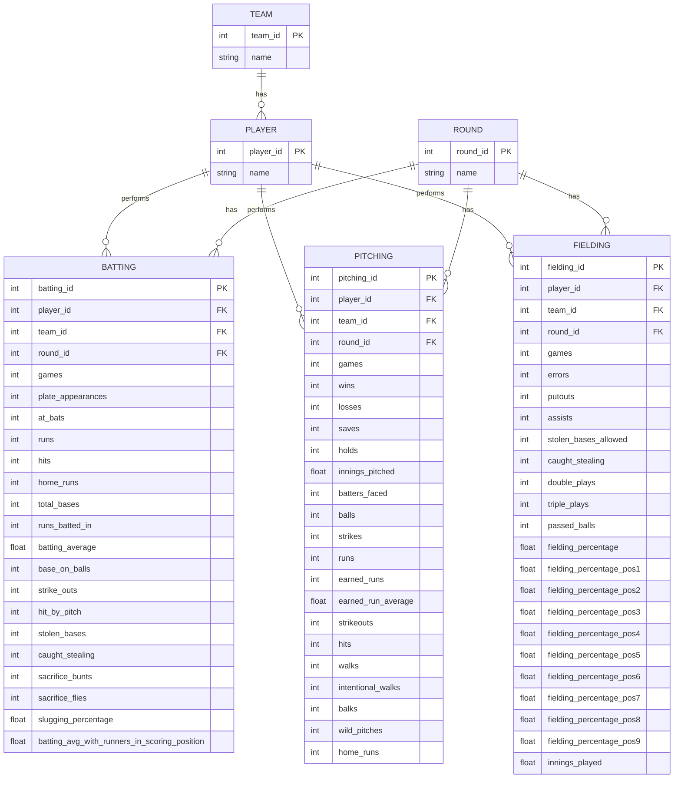

# Baseball Database Model

Below is a database model diagram for the baseball statistics tracking system based on the CSV output files.

## Entity Descriptions

### PLAYER
Represents a baseball player with a unique identifier and name.

### TEAM
Represents a baseball team with a unique identifier and name.

### ROUND
Represents a round or period of play in the league.

### BATTING
Tracks batting statistics for players in specific rounds and teams:
- Games played
- Plate appearances
- At-bats
- Runs
- Hits
- Home runs
- Total bases
- Runs batted in
- Batting average
- Base on balls (walks)
- Strikeouts
- Hit by pitch
- Stolen bases
- Caught stealing
- Sacrifice bunts
- Sacrifice flies
- Slugging percentage
- Batting average with runners in scoring position

### PITCHING
Tracks pitching statistics for players in specific rounds and teams:
- Games pitched
- Wins
- Losses
- Saves
- Holds
- Innings pitched
- Batters faced
- Balls thrown
- Strikes thrown
- Runs allowed
- Earned runs
- Earned run average
- Strikeouts
- Hits allowed
- Walks allowed
- Intentional walks
- Balks
- Wild pitches
- Home runs allowed

### FIELDING
Tracks fielding statistics for players in specific rounds and teams:
- Games played
- Errors
- Putouts
- Assists
- Stolen bases allowed
- Caught stealing
- Double plays
- Triple plays
- Passed balls
- Fielding percentage (overall)
- Fielding percentage by position (1-9)
- Innings played

Note: The diagram shows a general relationship model. Position-specific fielding statistics (PO1, A1, etc.) are included in the FIELDING entity but not explicitly shown in the diagram for clarity.